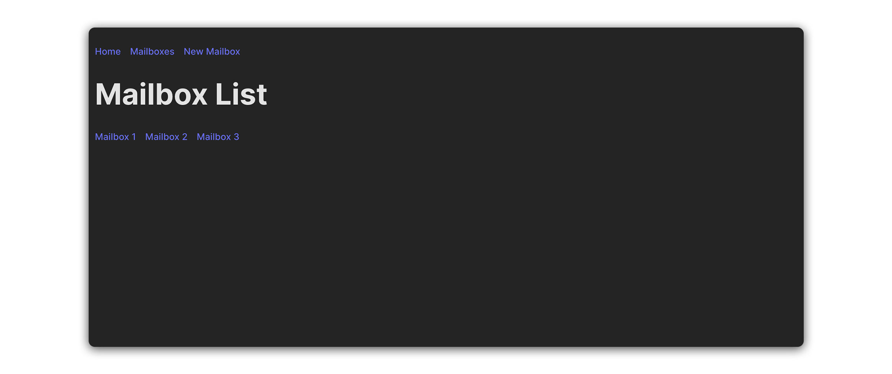
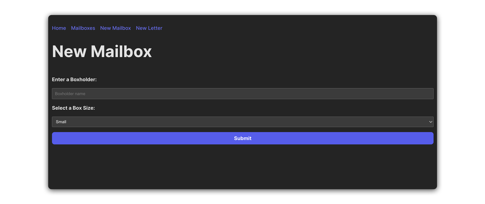

# React Router DOM Lab

## Overview
-------------------------------------------------------

#### In this lab, you will build an application that simulates a post office, where users can create new mailboxes, view a list of all mailboxes, and explore details about each mailbox.

#### You will utilize several client-side routing tools provided by React Router’s library to complete this lab.

#### Here are a few screenshots to reference as you work through this exercise:

#### Take a look at the component hierarchy diagram below for a sense of how this application will be structured:

.png>)

#### In the list below, you’ll find a brief description of the role of each component in our app:

* App: The root component that orchestrates the entire application.
* NavBar: Provides navigation links.
* MailboxForm: Allows users to enter details for and submit new mailboxes.
* MailboxList: Displays an index list of all mailboxes.
* MailboxDetails: Shows details about a specific mailbox.